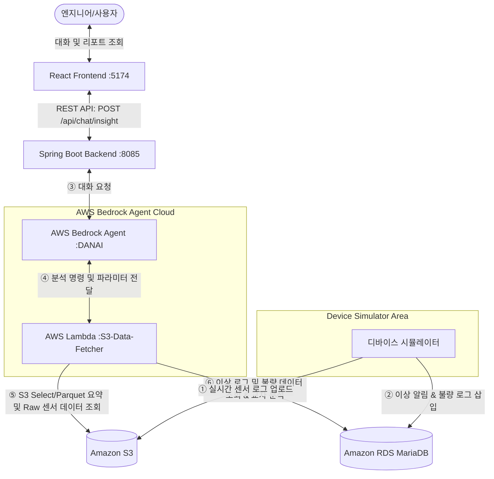
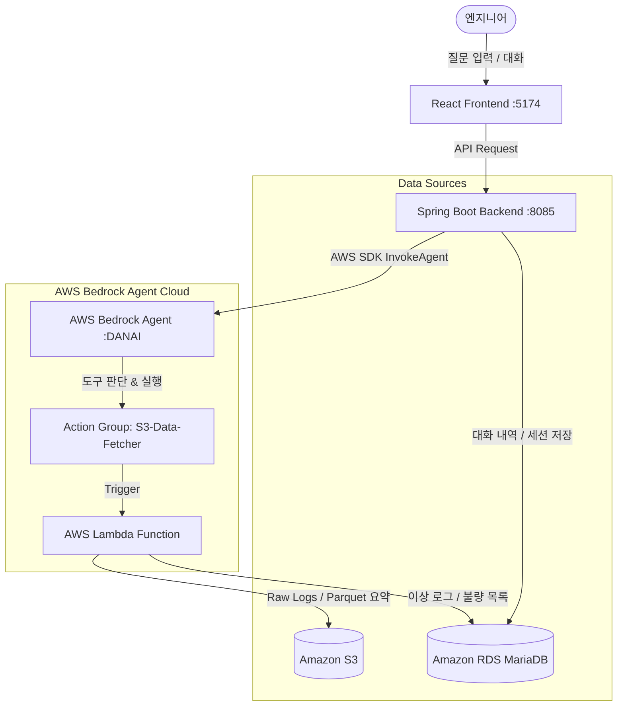

# 🤖 SIGMA 스마트 팩토리 진단 챗봇 서비스 (DANAI) - 시뮬레이터 연동 및 개발자 가이드

본 문서는 404 factory의 **디바이스 시뮬레이터(Device Simulator)** 개발자를 위한 상세 기술 연동 가이드입니다. 

시뮬레이터가 공정 설비(포토, 세정, 증착, 식각)에서 생성하는 센서 로그, 이상 탐지(Anomaly), 불량(Defect) 정보가 **AWS Bedrock Agent (DANAI)**와 **AWS Lambda**를 통해 어떻게 수집되고, 데이터가 어떻게 매핑 및 상관관계 분석에 활용되는지 데이터 규격 위주로 설명합니다.

---

## 🏗️ 1. 전체 아키텍처 및 데이터 흐름

시뮬레이터에서 발생한 데이터는 아래의 파이프라인을 거쳐 최종 사용자인 엔지니어에게 AI 진단 결과 리포트로 전달됩니다.



## 🧠 2. AWS Bedrock Agent (DANAI) 프롬프트 및 의사결정 로직

인공지능 진단 에이전트 **DANAI**의 역할정의, 프롬프트 인스트럭션(Prompt Instructions), 의사결정 규칙입니다. 에이전트는 이 가이드를 기반으로 스스로 판단하여 백엔드 도구(Lambda)를 호출합니다.

### 2.1 에이전트 역할 정의 (Role)
- **명칭**: 최고 진단 에이전트 'DANAI'
- **역할**: 스마트 팩토리 플랫폼의 공정 이상 로그와 불량 데이터를 비교 분석하여 실시간 장비 상태를 객관적이고 논리적으로 진단하는 AI 엔지니어.

### 2.2 의사결정 및 동작 순서 (Execution Flow)
사용자로부터 질문이 입력되면 에이전트는 아래 순서에 따라 판단합니다:
1. **도메인 필터링**: 질문이 스마트 팩토리, 설비, 공정, 레시피와 무관하면 툴 호출 없이 거부 메시지 출력.
2. **필수 매개변수 검증 (설비 ID)**: 공정명만 말하고 구체적인 설비 번호(1~4번 등)를 지정하지 않은 경우, 툴을 호출하지 않고 대화를 멈춘 뒤 설비 번호를 되물음.
3. **날짜 모호성 검증**: 날짜나 시각 정보가 모호한 과거 날짜인 경우, 툴 호출 없이 날짜를 되물음.
4. **30일 데이터 보존 여부 검증**: 오늘(2026-05-28) 기준 30일이 지난 과거 날짜(2026-04-28 이전)인 경우, 의도 확인 질문을 생략하고 `get_process_summary` 도구를 즉시 강제 호출.
5. **의도 확인 및 선택지 제시**: 날짜가 명시되어 있으나 목적이 모호한 경우, 툴 호출 전에 **선택식 질문(실제 센서 vs 요약 리포트)**을 출력하고 대기.
6. **도구 실행 및 결과 포맷팅**: 도구 결과를 받아 지정된 `<response_template>`에 맞춰 최종 리포트 작성.

### 2.3 핵심 프롬프트 인스트럭션 규칙 (Prompt Instructions)
1. **설비 ID 매핑 및 예외 규칙**
   - 자연어 질문의 오타나 조사, 띄어쓰기, 어순이 다르더라도 아래 표준 설비 ID(equipmentName)로 유치 및 치환하여 도구를 호출합니다.
     - *세정 1번/2번 ➔ EQP-CLEANING-001 / EQP-CLEANING-002*
     - *데포/증착/도포 1번/2번 ➔ EQP-DEPOSITION-001 / EQP-DEPOSITION-002*
     - *식각/에칭 1번/2번 ➔ EQP-ETCH-001 / EQP-ETCH-002*
     - *포토/노광 1번~4번 ➔ EQP-PHOTO-001 ... EQP-PHOTO-004*
   - 목록에 없는 번호(예: 포토 99번) 요청 시 툴 호출 없이 "해당 설비는 시스템에 존재하지 않는 설비입니다."라고 안내합니다.
2. **의도 확인 및 선택지 가이드 규칙**
   - 모호한 데이터 조회 요청 시 아래 템플릿 규격을 엄격히 지켜 질문을 출력합니다.
     ```
     [요청한 날짜] 데이터 조회를 요청하셨습니다. 어떤 분석을 원하시나요?
     1. 실제 센서 데이터 예시 조회: 해당 날짜의 실제 센서 측정치 샘플(Raw Data)을 확인합니다.
     2. 요약 및 진단 분석 리포트 조회: 해당 날짜의 일일 평균치, 가동률 및 이상 징후 요약(Summary Data)을 분석합니다.
     
     원하시는 번호나 분석 종류를 말씀해 주세요!
     ```
3. **1개월 데이터 보존 정책 및 경고 규칙**
   - 30일이 지난 과거 날짜 요청 시 리포트 최상단에 다음 경고창을 강제 출력합니다:
     `"⚠️ 해당 날짜는 30일이 지난 데이터이므로 Raw 로그가 삭제되어 요약 및 진단 분석 리포트만 제공 가능합니다."` (30일 이내의 최근 날짜에는 절대로 출력하지 않음)
4. **출력 형식 및 생각 노출 금지**
   - **생각 노출 절대 금지**: 답변 텍스트 시작 부분에 `Thought:` 또는 `생각:`과 같은 사유 과정을 노출하지 않고, 곧바로 사용자 답변 문장으로 시작해야 합니다.
   - **양식 엄수**: 정상 상태(NORMAL)이더라도 3단 템플릿 구조를 간략화하지 않고 명시적으로 작성합니다. (정상 시 3번 권장 조치에 `"특이사항 없음. 현재 표준 레시피 가동 상태를 유지하고 실시간 모니터링을 지속하십시오."` 명시)
   - **수치 가공**: 지수 표기법(예: `1.02e0`)은 소수점이나 정수 포맷으로 변환해 제공합니다.

### 2.4 퓨샷 대화 예시 (Few-Shot Examples)

#### 예시 1: 도메인 외 질의 필터링
- **User**: "오늘 점심 메뉴 추천해줘."
- **Agent**: "스마트 팩토리 공정 진단 외의 질문에는 답변할 수 없습니다."

#### 예시 2: 설비 ID 부재 시 되묻기
- **User**: "포토 공정 상태가 어때?"
- **Agent**: "어떤 설비 번호의 조회를 원하시나요?"

#### 예시 3: 날짜 모호 시 되묻기
- **User**: "세정 1번 설비 지난번에 이상 있었을 때 데이터 보여줘."
- **Agent**: "조회를 원하는 특정 날짜가 있으신가요?"

#### 예시 4: 의도 확인 메뉴 제시 (정상 흐름)
- **User**: "포토 4번 설비 5월 27일 데이터 보여줘."
- **Agent**: "5월 27일 데이터 조회를 요청하셨습니다. 어떤 분석을 원하시나요?
1. **실제 센서 데이터 예시 조회**: 해당 날짜의 실제 센서 측정치 샘플(Raw Data)을 확인합니다.
2. **요약 및 진단 분석 리포트 조회**: 해당 날짜의 일일 평균치, 가동률 및 이상 징후 요약(Summary Data)을 분석합니다.

원하시는 번호나 분석 종류를 말씀해 주세요!"

#### 예시 5: 정상 진단 리포트 출력 형태
- **User**: "1" (위 예시 4의 후속 턴으로 1번을 선택한 경우)
- **Agent**:
데이터 기준 시각: 2026년 05월 27일 08시 53분 02초

1. 진단 결과 (이상 징후 유무)
- S3 실시간 센서 데이터를 분석한 결과, 포토 공정의 장비 EQP-PHOTO-004 상태 파악 결과 정상 가동 중이며 이탈 징후가 없습니다.

2. 근거 데이터 (S3 수치 대조)
- **EQP-PHOTO-004 / Temperature**: 305.2°C (레시피 한계치: 280.0 ~ 320.0) [°C] ✅ 정상
- **EQP-PHOTO-004 / Pressure**: 1.01 atm (레시피 한계치: 0.95 ~ 1.10) [atm] ✅ 정상

3. 권장 조치 사항 (Action Item)
- 특이사항 없음. 현재 표준 레시피 가동 상태를 유지하고 실시간 모니터링을 지속하십시오.

📎 참조 데이터 소스: s3://sigma-310095858382-ap-northeast-2-an/2026/05/27/Device_simulator_04.json

#### 예시 6: 이상 감지 및 상관관계 리포트 출력 형태
- **User**: "세정 1번 설비 현재 상태와 이상 로그 분석해줘"
- **Agent**:
데이터 기준 시각: 2026년 05월 28일 14시 30분 00초

1. 진단 결과 (이상 징후 유무)
- S3 실시간 센서 데이터를 분석한 결과, 세정 공정의 장비 EQP-CLEANING-001에서 Chemical Temperature 수치가 임계 상한을 초과하여 이탈한 것이 확인되었습니다. 또한 동시간대(±30분 이내) 발생한 RDS 불량 정보를 교차 분석한 결과, 실제 공정 품질 불량이 유발되어 인과성이 매우 높은 이상 징후로 판단됩니다.

2. 근거 데이터 (S3 수치 대조)
- **EQP-CLEANING-001 / Chemical Temperature**: 52.4°C (레시피 한계치: 48.5 ~ 51.5) [°C] ⚠️ 상한 초과 (이상 로그 규칙: Upper Limit Exceeded)
- **EQP-CLEANING-001 / Chemical Concentration**: 0.98% (레시피 한계치: 0.97 ~ 1.03) [%] ✅ 정상
- **RDS 연계 불량 정보 (±30분 이내)**:
  - 발생 시각: 2026-05-28 14:40:00 (이상 로그 발생 10분 후)
  - 불량 유형 / 코드: Scratch / D-102
  - 대상 Lot ID / 등급: LOT-CLEAN-8831 / C등급

3. 권장 조치 사항 (Action Item)
- 원인 분류: [레시피 보정 필요]
- 세정액 가열 장치의 온도 센서 보정을 즉시 실시하고, 이탈 레시피 값의 파라미터 보정을 요구하십시오. 관련 Lot(LOT-CLEAN-8831)은 정밀 오염 테스트를 위해 라인 격리 조치를 권장합니다.

📎 참조 데이터 소스: s3://sigma-310095858382-ap-northeast-2-an/2026/05/28/Device_simulator_09.json

### 2.5 에이전트 응답 템플릿 (Response Template)
에이전트는 데이터 조회 성공 시 아래 3단 구조의 마크다운 템플릿 형태로 리포트를 응답합니다.

```markdown
데이터 기준 시각: YYYY년 MM월 DD일 HH시 mm분 ss초

1. 진단 결과 (이상 징후 유무)
- [진단 결과 서술: 정상 가동 중이거나 이상 수치 감지 여부]

2. 근거 데이터 (S3 수치 대조)
- **장비 ID / 센서 종류**: 실측 수치 (레시피 한계치: Min ~ Max) [단위]
- [각 센서 지표를 나열]

3. 권장 조치 사항 (Action Item)
- [조치 사항 서술: 정상 시 "특이사항 없음...", 이상 시 원인 분류 및 현장 조치 제안]

📎 참조 데이터 소스: s3://sigma-310095858382-ap-northeast-2-an/YYYY/MM/DD/...
```


## 🛠️ 3. AWS Bedrock Action Group 및 Lambda 작업 함수 명세

AWS Bedrock Agent는 **Action Group (`S3-Data-Fetcher`)**을 통해 아래 정의된 **AWS Lambda Function (`arn:aws:lambda:ap-northeast-2:310095858382:function:S3-Data-Fetcher-bvogc`)**을 트리거하여 데이터를 쿼리합니다.

### 3.1 람다 연동 함수 명세 (Function Schema)

#### ① `get_realtime_raw_logs` (실시간 Raw 센서 로그 조회)
- **설명**: 특정 공정 단계의 실시간 Raw 센서 로그 데이터를 S3에서 직접 수집 및 파싱합니다.
- **파라미터**:
  - `processStage` (string, **필수**): 분석할 공정 단계 (`CLEANING`, `DEPOSITION`, `ETCH`, `PHOTO` 중 하나)
  - `targetDate` (string, **선택**): 조회할 특정 일자 (`YYYY-MM-DD` 포맷)
- **Lambda 주요 동작**:
  1. `targetDate`가 오늘 기준 30일 이전이면 즉시 `EXPIRED_RAW_DATA` 에러 반환.
  2. S3의 `YYYY/MM/DD/` 경로에서 해당 공정단계에 매핑된 설비 ID 문자열이 포함된 JSON 파일을 필터링.
  3. 가장 최근 파일(`LastModified`)을 골라 바이트를 다운로드 후 JSON 파싱.
  4. `"measurements"` 배열에서 해당 설비 ID에 필터링된 최신 2개의 샘플 데이터를 추출해 반환.
  5. 데이터가 없을 경우 S3 전체 경로를 훑어 데이터가 있는 유효한 날짜 목록을 수집하여 `NO_RAW_DATA` 에러와 함께 반환.

#### ② `get_process_summary` (일일 통계 요약 데이터 조회)
- **설명**: 특정 공정 단계의 일일 요약(Summary) Parquet 통계 데이터를 조회합니다.
- **파라미터**:
  - `processStage` (string, **필수**): 분석할 공정 단계 (`CLEANING`, `DEPOSITION`, `ETCH`, `PHOTO` 중 하나)
  - `targetDate` (string, **선택**): 조회할 특정 일자 (`YYYY-MM-DD` 포맷)
- **Lambda 주요 동작**:
  1. S3 `summary-data/` 경로를 탐색해 요청한 날짜가 유효한지 검증. 없을 시 `NO_SUMMARY_DATA`와 가능 일자 목록 반환.
  2. 대상 설비별 Parquet 파일 경로를 획득.
  3. `s3_client.select_object_content` API를 호출하고 SQL 쿼리(`SELECT * FROM s3object LIMIT 5`)를 작성하여 Parquet에서 요약 통계 정보(평균치, 가동률 등)를 JSON 행 데이터로 전환하여 가져옴.

#### ③ `get_defect_analysis` (설비 및 공정 불량 분석)
- **설명**: 특정 설비 또는 공정에서 발생한 공정 불량(Defect) 건들을 MariaDB RDS에서 조회합니다.
- **파라미터**:
  - `processStage` (string, **선택**): 조회할 공정 단계
  - `equipmentName` (string, **선택**): 조회할 표준 설비명 (예: `EQP-PHOTO-004`)
- **Lambda 주요 동작**:
  1. RDS 커넥션 풀을 가동하여 `defect_info`와 `lot_info` 테이블을 `lot_id` 기준 LEFT JOIN 쿼리 실행.
  2. 설비명 또는 공정명 필터를 동적으로 붙여 최신 발생 순으로 정렬하여 최대 50건을 반환.

#### ④ `get_anomaly_defect_correlation` (이상 로그-불량 상관관계 상관분석)
- **설명**: 특정 설비의 이상 탐지 로그와 불량 데이터 간의 시간 기반 교차 매핑을 수행합니다.
- **파라미터**:
  - `equipmentName` (string, **필수**): 상관분석을 진행할 설비명 (예: `EQP-CLEANING-001`)
- **Lambda 주요 동작**:
  1. RDS `equipment_info`에서 설비명으로 고유 설비 ID 획득.
  2. `anomaly_log` 테이블에서 해당 설비의 최근 10건 이상 탐지 로그를 가져옴.
  3. **시간 기반 교차 매핑**: 각 이상 로그 시각(`occurred_time`) 기준 **`±30분`** 범위 안에서 `defect_info`를 조회.
  4. 이상 로그별 매핑된 불량 개수와 불량 코드를 취합하여 상관관계 판단 플래그(`correlation_detected`)를 생성해 반환.

### 3.2 람다 소스코드 핵심 구조 (Python 3.9+)
전체 소스코드는 [lambda_function.py](file:///C:/inspire/404factory/chatbot-service/lambda_src/lambda_function.py)에 구현되어 있으며 주요 특징은 다음과 같습니다:
- **종속성 격리**: `pymysql`을 람다 함수 내에 포함하여 패키징하였습니다.
- **S3 Select 활용**: 대용량 Parquet 파일을 메모리에 전부 올리지 않고도 효율적으로 일부 행만 필터링하기 위해 `s3_client.select_object_content`를 통해 SQL Expression을 날려 S3 가상 가속 처리를 구현하였습니다.
- **시리얼라이저 정밀화**: MariaDB에서 가져온 `datetime` 객체가 JSON 변환 과정에서 직렬화 에러를 유발하는 현상을 차단하기 위해, RDS 결과 셋을 돌며 발생 시간을 직접 `%Y-%m-%d %H:%M:%S` 문자열 포맷으로 변환해 주는 전처리 로직이 포함되어 있습니다.

---

## ☁️ 4. S3 데이터 레이어 연동 규격 (실시간 센서 로그)

시뮬레이터가 설비 가동 상태를 시뮬레이션하여 S3에 저장하는 실시간 로그 파일의 경로 구성 및 JSON 포맷 규격입니다.

### 4.1 S3 버킷 정보 및 파일 경로
- **버킷명**: `sigma-310095858382-ap-northeast-2-an`
- **Raw 데이터(실시간) 업로드 경로**: `YYYY/MM/DD/` (예: `2026/05/26/`)
  - *참고*: 파일명 자체는 자유롭게 생성 가능하나, Lambda에서 검색 효율성을 위해 파일명 또는 경로 내에 표준 설비 ID(예: `EQP-PHOTO-004`)가 포함되어야 필터링 및 조회가 가능합니다.

### 4.2 실시간 로그 JSON 스키마 규격
시뮬레이터는 아래와 같은 포맷으로 JSON을 적재해야 합니다.

```json
{
  "createdAt": "2026-05-26T14:30:00.000Z",
  "measurements": [
    {
      "equipmentId": "EQP-PHOTO-004",
      "temperature": 325.7,
      "pressure": 1.02,
      "vibration": 0.05,
      "exposureTime": 12.5
    },
    {
      "equipmentId": "EQP-PHOTO-004",
      "temperature": 326.1,
      "pressure": 1.01,
      "vibration": 0.04,
      "exposureTime": 12.8
    }
  ]
}
```

> [!IMPORTANT]
> **핵심 파싱 규칙**
> 1. JSON 루트 노드에 반드시 `"createdAt"` (ISO-8601 포맷 타임스탬프)과 `"measurements"` (배열) 키가 존재해야 합니다.
> 2. `"measurements"` 배열 내부의 각 객체는 설비를 식별할 수 있는 `"equipmentId"`(예: `EQP-PHOTO-004`)를 가지고 있어야 합니다.
> 3. AI 에이전트는 해당 일자 경로의 가장 마지막 수정 시간(`LastModified`)을 가진 JSON 파일을 읽은 뒤, **`measurements` 배열의 마지막 2개 샘플(최신 데이터)**을 추출하여 표준 레시피 한계치와 비교 분석합니다.

---

## 🗄️ 5. RDS 데이터 레이어 연동 규격 (이상 및 불량 데이터)

시뮬레이터 및 상관관계 검증 프로세스가 RDS (`factory_db`) 마리아디비에 적재해야 하는 테이블 명세 및 AI 분석 로직입니다.

### 5.1 표준 설비 매핑 정보 (`equipment_info`)
AI 에이전트가 사용하는 표준 설비 ID와 시뮬레이터의 설비명 매핑 구조입니다.

| 설비 ID (RDBMS DB Key) | 설비 코드 (S3/RDBMS) | 실제 공정명 (Process) |
| :---: | :---: | :---: |
| **1** | `EQP-DEPOSITION-001` | 도포 (DEPOSITION) |
| **2** | `EQP-DEPOSITION-002` | 도포 (DEPOSITION) |
| **3** | `EQP-PHOTO-001` | 포토 (PHOTO) |
| **4** | `EQP-PHOTO-002` | 포토 (PHOTO) |
| **5** | `EQP-PHOTO-003` | 포토 (PHOTO) |
| **6** | `EQP-PHOTO-004` | 포토 (PHOTO) |
| **7** | `EQP-ETCH-001` | 식각 (ETCH) |
| **8** | `EQP-ETCH-002` | 식각 (ETCH) |
| **9** | `EQP-CLEANING-001` | 세정 (CLEANING) |
| **10** | `EQP-CLEANING-002` | 세정 (CLEANING) |

### 5.2 이상 로그 테이블 스키마 (`anomaly_log`)
시뮬레이터가 이탈 값(레시피 범위를 벗어난 이상 수치)을 감지했을 때 적재하는 테이블입니다.

```sql
CREATE TABLE anomaly_log (
    log_id INT AUTO_INCREMENT PRIMARY KEY,
    equipment_id INT NOT NULL,              -- equipment_info 테이블의 ID (1~10)
    recipe_parameter VARCHAR(50),           -- 이상이 발생한 센서명 (예: 'Temperature')
    rule_name VARCHAR(100),                 -- 탐지 규칙명 (예: 'Upper Limit Exceeded')
    severity VARCHAR(20),                   -- 심각도 ('WARNING' 또는 'CRITICAL')
    occurred_time DATETIME NOT NULL,        -- 발생 시각
    FOREIGN KEY (equipment_id) REFERENCES equipment_info(equipment_id)
);
```

### 5.3 불량 정보 테이블 스키마 (`defect_info`)
공정 완료 후 품질 검사 장비나 시뮬레이터가 판정한 불량(Defect) 이력 테이블입니다.

```sql
CREATE TABLE defect_info (
    defect_id INT AUTO_INCREMENT PRIMARY KEY,
    lot_id VARCHAR(50) NOT NULL,             -- Lot 식별자
    defect_type VARCHAR(50) NOT NULL,        -- 불량 유형 (예: 'Scratch', 'Particle')
    defect_code VARCHAR(20) NOT NULL,        -- 불량 코드 (예: 'D-102')
    occurred_time DATETIME NOT NULL,         -- 불량 판정 시각
    cause_equipment_name VARCHAR(50),        -- 원인 의심 설비 코드 (예: 'EQP-PHOTO-004')
    cause_process_name VARCHAR(50)           -- 원인 의심 공정명 (예: 'PHOTO')
);
```

### 5.4 ⚠️ 인과관계 교차 상관분석 로직 (±30분 룰)
시뮬레이터가 가상 시나리오를 만들 때 가장 주의해야 하는 연동 핵심 로직입니다.

- **AI 분석 시점**: 사용자가 특정 설비의 이상 원인을 분석해 달라고 요청할 때 (`get_anomaly_defect_correlation` 함수 가동)
- **시간 매핑 조건**: Lambda 엔진은 해당 설비의 최근 10건 이상 로그(`anomaly_log`)를 가져온 후, 각 이상 로그의 발생 시각(`occurred_time`) 기준 **`±30분` 범위** 내에 동일 설비(`cause_equipment_name`)에서 발생한 불량 이력(`defect_info`)이 있는지 교차 조회(JOIN)합니다.
- **시뮬레이터 구성 가이드**: 만약 시뮬레이터가 `anomaly_log`에 이상 수치 발생 시각을 `14:00`으로 기록했다면, 그로 인해 유발된 불량 정보(`defect_info`) 역시 `13:30 ~ 14:30` 사이의 시간으로 RDS에 적재해야 AI가 정상적으로 이상-불량 간 인과관계를 발견하고 원인 보고서를 작성할 수 있습니다. 

---

## 🎯 6. AI 에이전트 검증용 골든 셋 (Golden Set) 시나리오

디바이스 시뮬레이터로 생성한 데이터가 시스템에 완벽히 연동되어 작동하는지 검증하기 위한 대표 골든 셋 시나리오 2종입니다. 시뮬레이터 실행 후 챗봇 UI에서 아래 질문을 통해 검증하십시오.

### 시나리오 A: S3 실시간 센서 진단 테스트
- **사용자 질문**: `포토 공정 4번 2026-05-26 데이터 보여줘`
- **시뮬레이터 검증 조건**:
  - S3 버킷의 `2026/05/26/` 경로 밑에 `EQP-PHOTO-004`를 포함하는 파일명의 JSON 로그 파일이 존재해야 함.
  - JSON 내 `measurements` 배열에 `equipmentId: "EQP-PHOTO-004"`를 가진 노드와 센서 값(temperature, pressure 등)이 올바르게 적재되어 있어야 함.
- **AI 예상 답변**:
  - 데이터의 최신 수치를 파악하여 레시피 한계값과 대비해 정상 여부를 3단 리포트 형태(진단결과 / 근거데이터 / 권장조치)로 자동 출력하며, 하단에 연동된 S3 경로를 참조 링크(`s3://sigma-...`)로 표기합니다.

### 시나리오 B: RDS 이상-불량 상관관계 진단 테스트
- **사용자 질문**: `세정 1번 이상 분석`
- **시뮬레이터 검증 조건**:
  - RDS `anomaly_log`에 `equipment_id = 9` (EQP-CLEANING-001)에 해당하는 이상 데이터 1건 이상 적재.
  - RDS `defect_info`에 `cause_equipment_name = 'EQP-CLEANING-001'`를 가진 불량 이력이 위 이상 로그 발생 시간 기준 **±30분 이내**로 적재되어 있어야 함.
- **AI 예상 답변**:
  - 세정 1번 설비에서 발생한 이상 로그 목록과 그 근방(±30분)에 발생한 실제 공정 불량 건수 및 코드를 나열하여, 해당 센서 이상이 불량을 유발했을 확률이 높다는 종합 상관분석 결과를 도출해 냅니다.

---

## 📂 7. 프로젝트 디렉토리 구조

서비스 소스코드는 아래와 같은 구조로 이루어져 있습니다.

```
C:/inspire/404factory/
├── chatbot-service/         
│   ├── chatbot_service/     # 🎯 Spring Boot Backend (본 문서는 이 위치에 존재합니다)
│   │   ├── src/main/java/com/factory/chatbot_service/
│   │   │   ├── controller/   # API 엔드포인트 제어 (Chat, Recipe 등)
│   │   │   ├── service/      # Bedrock Agent 연동 서비스 ([BedrockAgentService.java](file:///C:/inspire/404factory/chatbot-service/chatbot_service/src/main/java/com/factory/chatbot_service/service/BedrockAgentService.java))
│   │   │   └── dto/          # 데이터 전송 객체 정의
│   │   ├── src/main/resources/
│   │   │   └── application.yml # 데이터베이스 및 AWS ID 설정 파일 ([application.yml](file:///C:/inspire/404factory/chatbot-service/chatbot_service/src/main/resources/application.yml))
│   │   ├── .env             # 🔐 AWS Credential 및 로컬 환경변수 파일 ([.env](file:///C:/inspire/404factory/chatbot-service/chatbot_service/.env))
│   │   └── build.gradle     # 빌드 종속성 관리
│   └── lambda_src/          # ☁️ AWS Lambda Python 소스코드 (S3 및 RDS 연결 논리 엔진)
│       └── lambda_function.py # AWS Bedrock Action Group 핸들러 ([lambda_function.py](file:///C:/inspire/404factory/chatbot-service/lambda_src/lambda_function.py))
└── frontend/                # 💻 React / Vite Frontend (챗봇 사용자 인터페이스)
    ├── src/pages/
    │   └── ChatbotPage.tsx  # markdown 렌더링 최적화 챗봇 화면 ([ChatbotPage.tsx](file:///C:/inspire/404factory/frontend/src/pages/ChatbotPage.tsx))
    └── package.json
```

---

## ⚙️ 8. 실행 및 로컬 구동 가이드

시뮬레이터 연동 상태에서 챗봇 서비스를 직접 띄워 테스트하기 위한 환경 설정 및 실행 방법입니다.

### 8.1 환경 변수 구성 (.env)
백엔드 프로젝트 루트(`chatbot-service/chatbot_service/`)에 `.env` 파일을 생성하고 아래 자격 증명을 올바르게 입력합니다.
```env
# RDS 데이터베이스 연결 정보
# 🤖 SIGMA 스마트 팩토리 진단 챗봇 서비스 (DANAI)

본 서비스는 스마트 팩토리 플랫폼 **SIGMA**의 제조 공정 데이터(S3 및 RDS)를 비교·분석하여, 장비의 실시간 상태 및 불량 인과관계를 진단하는 AI 엔지니어 에이전트 **DANAI**의 백엔드 및 프론트엔드 모듈입니다.

---

## 🏗️ 전체 아키텍처 및 데이터 흐름



---

## 🌟 핵심 제공 기능

### 1. 자연스러운 한국어 설비 ID 매핑
- 엔지니어가 자연스러운 한국어로 질문해도 자동으로 시스템의 표준 설비 ID로 매핑하여 AWS S3/RDS 도구를 호출합니다.
  - *예: "세정 설비 1번 데이터 조회해줘" ➔ `EQP-CLEANING-001` 자동 매핑*

### 2. 1개월 Raw 데이터 보존 정책 및 자동 폴백 (Fallback)
- S3의 실시간 센서 로그(Raw JSON) 보존 정책(1개월)에 맞추어 지능적으로 분기합니다.
  - **30일 이내 날짜**: 사용자의 선택에 따라 **실시간 Raw 센서 로그** 샘플 또는 **요약 데이터**를 자유롭게 조회 가능합니다.
  - **30일 초과 날짜**: Raw 로그가 만료되었음을 사용자에게 친절하게 설명하고, 자동으로 **일일 요약 통계(Summary Parquet) 데이터**를 조회하여 분석 보고서를 제공합니다.

### 3. 데이터 부재 시 지능적인 날짜 추천 (Date Discovery)
- 사용자가 조회하려는 날짜에 데이터가 적재되어 있지 않은 경우, 단순 에러로 종료하지 않고 **S3에 실제 데이터가 존재하는 날짜 목록**을 스캔하여 사용자에게 대안으로 제시하고 재조회를 유도합니다.
  - *예: "죄송합니다. 2026-05-25에는 데이터가 존재하지 않습니다. 현재 조회 가능한 날짜는 2026-05-26, 2026-05-27 등입니다. 다른 날짜를 조회하시겠습니까?"*

### 4. 양방향 분석 선택 가이드 (Intent Clarification)
- 사용자가 날짜 정보만 모호하게 요청한 경우(예: "5월 26일 데이터 보여줘"), 사용자의 실제 니즈를 파악하기 위해 두 가지 조회 옵션을 제공하는 선택 메뉴를 출력합니다.
  1. **실제 센서 데이터 예시 조회** (Raw metrics sample)
  2. **요약 및 진단 분석 리포트 조회** (Daily summary stats & anomaly correlation)

---

## 📂 프로젝트 구조

```
chatbot-service/
├── chatbot_service/         # Spring Boot Backend
│   ├── src/main/java/...    # JPA Entities, Repositories, Controllers, Services
│   ├── src/main/resources/  # application.yml 설정 파일
│   ├── .env                 # AWS Bedrock 및 DB 연결용 로컬 환경변수 파일
│   └── build.gradle         # Gradle 빌드 스크립트
├── frontend/                # React / Vite Frontend
│   ├── src/                 # React 컴포넌트, 챗 페이지 및 스타일시트
│   ├── package.json         # npm 패키지 의존성
│   └── vite.config.ts       # Vite 설정 파일
└── README.md                # 본 문서
```

---

## ⚙️ 실행 및 배포 가이드

### 1. 환경 변수 구성 (.env)
백엔드 루트 경로(`chatbot_service/.env`)에 아래와 같이 DB 및 AWS 에이전트 자격 증명을 작성합니다.
```env
# Database Credentials
DB_URL=jdbc:mariadb://factory-db.c5g4a4ekcfvb.ap-northeast-2.rds.amazonaws.com:3306/factory_db?useSSL=true&trustServerCertificate=true
DB_USERNAME=root
DB_PASSWORD=12345678

# AWS Bedrock Agent 식별 정보 (AWS CLI 설정이나 IAM 환경 변수가 필요할 수 있습니다)
AWS_AGENT_ID=SHFTOIN2IV
AWS_AGENT_ALIAS_ID=MTN5THYODH
```

### 8.2 백엔드 구동 (Spring Boot)
Gradle wrapper를 사용하여 백엔드 애플리케이션을 구동합니다. 구동 시 포트는 `8085`가 사용됩니다.
```bash
cd C:/inspire/404factory/chatbot-service/chatbot_service
./gradlew bootRun
```

### 8.3 프론트엔드 구동 (React)
패키지 매니저로 `pnpm`을 사용합니다. 프론트엔드는 `5174` 포트에서 실행됩니다.
```bash
cd C:/inspire/404factory/frontend
# AWS Bedrock Agent Credentials
AWS_AGENT_ID=SHFTOIN2IV
AWS_AGENT_ALIAS_ID=WZEO7SABQD
```

### 2. 백엔드 실행 (Spring Boot)
백엔드 폴더로 이동한 후 Gradle 부트런 명령어로 서버를 켭니다. (기본 포트: `8085`)
```bash
cd chatbot_service
./gradlew bootRun
```

### 3. 프론트엔드 실행 (React)
프론트엔드 폴더로 이동하여 패키지를 설치하고 개발 서버를 가동합니다. (포트: `5173` 또는 `5174`)
```bash
cd frontend
pnpm install
pnpm run dev
```

---

## 🌐 9. 주요 API 명세

### 9.1 실시간 인공지능 진단 및 대화 요청
## 🌐 주요 API 사양

### 1. AI 진단 분석 요청
- **Endpoint**: `POST /api/chat/insight`
- **Request Body**:
  ```json
  {
    "equipmentId": 6,
    "content": "포토 공정 4번 2026-05-26 데이터 보여줘",
    "roomId": "room-session-uuid"
  }
  ```
  - *roomId*: Bedrock Agent의 세션 ID로 직접 매핑되어 멀티턴 대화의 컨텍스트를 유지하는 고유 식별자입니다.
- **Response Body**:
  ```json
  {
    "reply": "데이터 기준 시각: 2026년 05월 26일 ... \n\n1. 진단 결과 ... \n2. 근거 데이터 ... \n3. 권장 조치 ..."
  }
  ```

### 9.2 대화 목록 및 이력 관리 API
- **대화방 목록 조회**: `GET /api/chat/rooms` (과거 진단 이력 세션을 탐색)
- **대화방 삭제**: `DELETE /api/chat/rooms/{roomId}`
- **대화 내역 상세 조회**: `GET /api/chat/rooms/{roomId}/messages`
    "equipmentId": 4, // 특정 설비 번호 (null 허용)
    "content": "세정 설비 1번 2026-05-27 데이터 보여줘", // 유저 프롬프트
    "roomId": "room-session-uuid" // 세션 유지용 대화방 ID
  }
  ```
- **Response**:
  ```json
  {
    "reply": "데이터 기준 시각: 2026년 05월 27일 ... \n\n1. 진단 결과 ... \n2. 근거 데이터 ... \n3. 권장 조치 ..."
  }
  ```

### 2. 대화 기록 관리
- **대화방 목록 조회**: `GET /api/chat/rooms`
- **대화 내역 상세 조회**: `GET /api/chat/rooms/{roomId}/messages`
- **대화방 삭제**: `DELETE /api/chat/rooms/{roomId}`
