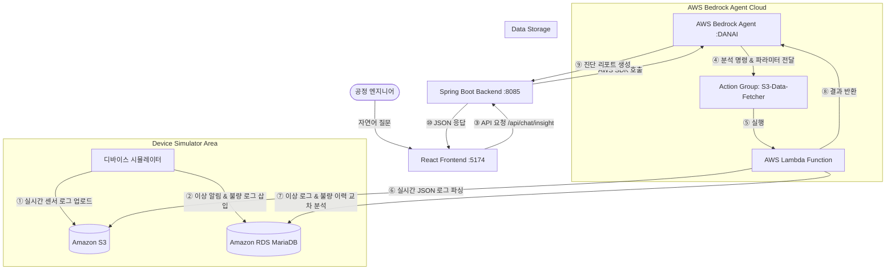

# 🤖 SIGMA 스마트 팩토리 진단 챗봇 서비스 (DANAI) - 시뮬레이터 연동 및 개발자 가이드

본 문서는 404 factory의 **디바이스 시뮬레이터(Device Simulator)** 개발자를 위한 상세 기술 연동 가이드입니다. 

시뮬레이터가 공정 설비(포토, 세정, 증착, 식각)에서 생성하는 센서 로그, 이상 탐지(Anomaly), 불량(Defect) 정보가 **AWS Bedrock Agent (DANAI)**와 **AWS Lambda**를 통해 어떻게 수집되고, 데이터가 어떻게 매핑 및 상관관계 분석에 활용되는지 데이터 규격 위주로 설명합니다.

---

## 🏗️ 1. 전체 아키텍처 및 데이터 흐름

시뮬레이터에서 발생한 데이터는 아래의 파이프라인을 거쳐 최종 사용자인 엔지니어에게 AI 진단 결과 리포트로 전달됩니다.



---

## ☁️ 2. S3 데이터 레이어 연동 규격 (실시간 센서 로그)

시뮬레이터가 설비 가동 상태를 시뮬레이션하여 S3에 저장하는 실시간 로그 파일의 경로 구성 및 JSON 포맷 규격입니다.

### 2.1 S3 버킷 정보 및 파일 경로
- **버킷명**: `sigma-310095858382-ap-northeast-2-an`
- **Raw 데이터(실시간) 업로드 경로**: `YYYY/MM/DD/` (예: `2026/05/26/`)
  - *참고*: 파일명 자체는 자유롭게 생성 가능하나, Lambda에서 검색 효율성을 위해 파일명 또는 경로 내에 표준 설비 ID(예: `EQP-PHOTO-004`)가 포함되어야 필터링 및 조회가 가능합니다.

### 2.2 실시간 로그 JSON 스키마 규격
Lambda 수집 엔진([lambda_function.py](file:///C:/inspire/404factory/chatbot-service/lambda_src/lambda_function.py))이 파싱할 수 있도록, 시뮬레이터는 아래와 같은 포맷으로 JSON을 적재해야 합니다.

```json
{
  "createdAt": "2026-05-26T14:30:00.000Z",
  "measurements": [
    {
      "equipmentId": "EQP-PHOTO-004",
      "temperature": 325.7,
      "pressure": 1.02,
      "vibration": 0.05,
      "exposureTime": 12.5
    },
    {
      "equipmentId": "EQP-PHOTO-004",
      "temperature": 326.1,
      "pressure": 1.01,
      "vibration": 0.04,
      "exposureTime": 12.8
    }
  ]
}
```

> [!IMPORTANT]
> **핵심 파싱 규칙**
> 1. JSON 루트 노드에 반드시 `"createdAt"` (ISO-8601 포맷 타임스탬프)과 `"measurements"` (배열) 키가 존재해야 합니다.
> 2. `"measurements"` 배열 내부의 각 객체는 설비를 식별할 수 있는 `"equipmentId"`(예: `EQP-PHOTO-004`)를 가지고 있어야 합니다.
> 3. AI 에이전트는 해당 일자 경로의 가장 마지막 수정 시간(`LastModified`)을 가진 JSON 파일을 읽은 뒤, **`measurements` 배열의 마지막 2개 샘플(최신 데이터)**을 추출하여 표준 레시피 한계치와 비교 분석합니다.

### 2.3 데이터 보존(Retention) 및 폴백(Fallback) 예외 처리
1. **30일 보존 정책 (Expired Data Fallback)**
   - 실시간 Raw 로그 데이터는 **최근 30일 이내**의 데이터만 보존됩니다.
   - 30일이 경과된 과거 날짜의 데이터를 요청받은 경우, Lambda는 `EXPIRED_RAW_DATA` 에러를 반환합니다. Bedrock 에이전트는 이를 감지하여 사용자에게 Raw 로그 대신 일일 단위로 축적된 Parquet 통계 요약 데이터(`summary-data/`)를 조회하도록 안내합니다.
2. **데이터 부재 시 날짜 추천 기능 (Date Discovery)**
   - 사용자가 요청한 날짜에 적재된 S3 로그 파일이 존재하지 않는 경우(예: 시뮬레이터가 중지된 날짜), Lambda는 에러로 멈추지 않고 S3 내에 저장되어 있는 모든 날짜 디렉토리를 정밀 스캔하여 **실제 데이터가 존재하는 날짜 목록**을 반환합니다.
   - 예: `NO_RAW_DATA: 해당 날짜에 raw 데이터가 존재하지 않습니다. 조회 가능한 날짜: [2026-05-26, 2026-05-28]`
   - Bedrock 에이전트는 이 목록을 읽어 사용자에게 대안 날짜를 추천해 줍니다.

---

## 🗄️ 3. RDS 데이터 레이어 연동 규격 (이상 및 불량 데이터)

시뮬레이터 및 상관관계 검증 프로세스가 RDS (`factory_db`) 마리아디비에 적재해야 하는 테이블 명세 및 AI 분석 로직입니다.

### 3.1 표준 설비 매핑 정보 (`equipment_info`)
AI 에이전트가 사용하는 표준 설비 ID와 시뮬레이터의 설비명 매핑 구조입니다.

| 설비 ID (RDBMS DB Key) | 설비 코드 (S3/RDBMS) | 실제 공정명 (Process) |
| :---: | :---: | :---: |
| **1** | `EQP-DEPOSITION-001` | 도포 (DEPOSITION) |
| **2** | `EQP-DEPOSITION-002` | 도포 (DEPOSITION) |
| **3** | `EQP-PHOTO-001` | 포토 (PHOTO) |
| **4** | `EQP-PHOTO-002` | 포토 (PHOTO) |
| **5** | `EQP-PHOTO-003` | 포토 (PHOTO) |
| **6** | `EQP-PHOTO-004` | 포토 (PHOTO) |
| **7** | `EQP-ETCH-001` | 식각 (ETCH) |
| **8** | `EQP-ETCH-002` | 식각 (ETCH) |
| **9** | `EQP-CLEANING-001` | 세정 (CLEANING) |
| **10** | `EQP-CLEANING-002` | 세정 (CLEANING) |

### 3.2 이상 로그 테이블 스키마 (`anomaly_log`)
시뮬레이터가 이탈 값(레시피 범위를 벗어난 이상 수치)을 감지했을 때 적재하는 테이블입니다.

```sql
CREATE TABLE anomaly_log (
    log_id INT AUTO_INCREMENT PRIMARY KEY,
    equipment_id INT NOT NULL,              -- equipment_info 테이블의 ID (1~10)
    recipe_parameter VARCHAR(50),           -- 이상이 발생한 센서명 (예: 'Temperature')
    rule_name VARCHAR(100),                 -- 탐지 규칙명 (예: 'Upper Limit Exceeded')
    severity VARCHAR(20),                   -- 심각도 ('WARNING' 또는 'CRITICAL')
    occurred_time DATETIME NOT NULL,        -- 발생 시각
    FOREIGN KEY (equipment_id) REFERENCES equipment_info(equipment_id)
);
```

### 3.3 불량 정보 테이블 스키마 (`defect_info`)
공정 완료 후 품질 검사 장비나 시뮬레이터가 판정한 불량(Defect) 이력 테이블입니다.

```sql
CREATE TABLE defect_info (
    defect_id INT AUTO_INCREMENT PRIMARY KEY,
    lot_id VARCHAR(50) NOT NULL,             -- Lot 식별자
    defect_type VARCHAR(50) NOT NULL,        -- 불량 유형 (예: 'Scratch', 'Particle')
    defect_code VARCHAR(20) NOT NULL,        -- 불량 코드 (예: 'D-102')
    occurred_time DATETIME NOT NULL,         -- 불량 판정 시각
    cause_equipment_name VARCHAR(50),        -- 원인 의심 설비 코드 (예: 'EQP-PHOTO-004')
    cause_process_name VARCHAR(50)           -- 원인 의심 공정명 (예: 'PHOTO')
);
```

### 3.4 ⚠️ 인과관계 교차 상관분석 로직 (±30분 룰)
시뮬레이터가 가상 시나리오를 만들 때 가장 주의해야 하는 연동 핵심 로직입니다.

- **AI 분석 시점**: 사용자가 특정 설비의 이상 원인을 분석해 달라고 요청할 때 (`get_anomaly_defect_correlation` 함수 가동)
- **시간 매핑 조건**: Lambda 엔진은 해당 설비의 최근 10건 이상 로그(`anomaly_log`)를 가져온 후, 각 이상 로그의 발생 시각(`occurred_time`) 기준 **`±30분` 범위** 내에 동일 설비(`cause_equipment_name`)에서 발생한 불량 이력(`defect_info`)이 있는지 교차 조회(JOIN)합니다.
- **시뮬레이터 구성 가이드**: 만약 시뮬레이터가 `anomaly_log`에 이상 수치 발생 시각을 `14:00`으로 기록했다면, 그로 인해 유발된 불량 정보(`defect_info`) 역시 `13:30 ~ 14:30` 사이의 시간으로 RDS에 적재해야 AI가 정상적으로 이상-불량 간 인과관계를 발견하고 원인 보고서를 작성할 수 있습니다. 

---

## 🎯 4. AI 에이전트 검증용 골든 셋 (Golden Set) 시나리오

디바이스 시뮬레이터로 생성한 데이터가 시스템에 완벽히 연동되어 작동하는지 검증하기 위한 대표 골든 셋 시나리오 2종입니다. 시뮬레이터 실행 후 챗봇 UI에서 아래 질문을 통해 검증하십시오.

### 시나리오 A: S3 실시간 센서 진단 테스트
- **사용자 질문**: `포토 공정 4번 2026-05-26 데이터 보여줘`
- **시뮬레이터 검증 조건**:
  - S3 버킷의 `2026/05/26/` 경로 밑에 `EQP-PHOTO-004`를 포함하는 파일명의 JSON 로그 파일이 존재해야 함.
  - JSON 내 `measurements` 배열에 `equipmentId: "EQP-PHOTO-004"`를 가진 노드와 센서 값(temperature, pressure 등)이 올바르게 적재되어 있어야 함.
- **AI 예상 답변**:
  - 데이터의 최신 수치를 파악하여 레시피 한계값과 대비해 정상 여부를 3단 리포트 형태(진단결과 / 근거데이터 / 권장조치)로 자동 출력하며, 하단에 연동된 S3 경로를 참조 링크(`s3://sigma-...`)로 표기합니다.

### 시나리오 B: RDS 이상-불량 상관관계 진단 테스트
- **사용자 질문**: `세정 1번 이상 분석`
- **시뮬레이터 검증 조건**:
  - RDS `anomaly_log`에 `equipment_id = 9` (EQP-CLEANING-001)에 해당하는 이상 데이터 1건 이상 적재.
  - RDS `defect_info`에 `cause_equipment_name = 'EQP-CLEANING-001'`를 가진 불량 이력이 위 이상 로그 발생 시간 기준 **±30분 이내**로 적재되어 있어야 함.
- **AI 예상 답변**:
  - 세정 1번 설비에서 발생한 이상 로그 목록과 그 근방(±30분)에 발생한 실제 공정 불량 건수 및 코드를 나열하여, 해당 센서 이상이 불량을 유발했을 확률이 높다는 종합 상관분석 결과를 도출해 냅니다.

---

## 📂 5. 프로젝트 디렉토리 구조

서비스 소스코드는 아래와 같은 구조로 이루어져 있습니다.

```
C:/inspire/404factory/
├── chatbot-service/         
│   ├── chatbot_service/     # 🎯 Spring Boot Backend (본 문서는 이 위치에 존재합니다)
│   │   ├── src/main/java/com/factory/chatbot_service/
│   │   │   ├── controller/   # API 엔드포인트 제어 (Chat, Recipe 등)
│   │   │   ├── service/      # Bedrock Agent 연동 서비스 ([BedrockAgentService.java](file:///C:/inspire/404factory/chatbot-service/chatbot_service/src/main/java/com/factory/chatbot_service/service/BedrockAgentService.java))
│   │   │   └── dto/          # 데이터 전송 객체 정의
│   │   ├── src/main/resources/
│   │   │   └── application.yml # 데이터베이스 및 AWS ID 설정 파일 ([application.yml](file:///C:/inspire/404factory/chatbot-service/chatbot_service/src/main/resources/application.yml))
│   │   ├── .env             # 🔐 AWS Credential 및 로컬 환경변수 파일 ([.env](file:///C:/inspire/404factory/chatbot-service/chatbot_service/.env))
│   │   └── build.gradle     # 빌드 종속성 관리
│   └── lambda_src/          # ☁️ AWS Lambda Python 소스코드 (S3 및 RDS 연결 논리 엔진)
│       └── lambda_function.py # AWS Bedrock Action Group 핸들러 ([lambda_function.py](file:///C:/inspire/404factory/chatbot-service/lambda_src/lambda_function.py))
└── frontend/                # 💻 React / Vite Frontend (챗봇 사용자 인터페이스)
    ├── src/pages/
    │   └── ChatbotPage.tsx  # markdown 렌더링 최적화 챗봇 화면 ([ChatbotPage.tsx](file:///C:/inspire/404factory/frontend/src/pages/ChatbotPage.tsx))
    └── package.json
```

---

## ⚙️ 6. 실행 및 로컬 구동 가이드

시뮬레이터 연동 상태에서 챗봇 서비스를 직접 띄워 테스트하기 위한 환경 설정 및 실행 방법입니다.

### 6.1 환경 변수 구성 (.env)
백엔드 프로젝트 루트(`chatbot-service/chatbot_service/`)에 `.env` 파일을 생성하고 아래 자격 증명을 올바르게 입력합니다.
```env
# RDS 데이터베이스 연결 정보
DB_URL=jdbc:mariadb://factory-db.c5g4a4ekcfvb.ap-northeast-2.rds.amazonaws.com:3306/factory_db?useSSL=true&trustServerCertificate=true
DB_USERNAME=root
DB_PASSWORD=12345678

# AWS Bedrock Agent 식별 정보 (AWS CLI 설정이나 IAM 환경 변수가 필요할 수 있습니다)
AWS_AGENT_ID=SHFTOIN2IV
AWS_AGENT_ALIAS_ID=MTN5THYODH
```

### 6.2 백엔드 구동 (Spring Boot)
Gradle wrapper를 사용하여 백엔드 애플리케이션을 구동합니다. 구동 시 포트는 `8085`가 사용됩니다.
```bash
cd C:/inspire/404factory/chatbot-service/chatbot_service
./gradlew bootRun
```

### 6.3 프론트엔드 구동 (React)
패키지 매니저로 `pnpm`을 사용합니다. 프론트엔드는 `5174` 포트에서 실행됩니다.
```bash
cd C:/inspire/404factory/frontend
pnpm install
pnpm run dev
```

---

## 🌐 7. 주요 API 명세

### 7.1 실시간 인공지능 진단 및 대화 요청
- **Endpoint**: `POST /api/chat/insight`
- **Request Body**:
  ```json
  {
    "equipmentId": 6,
    "content": "포토 공정 4번 2026-05-26 데이터 보여줘",
    "roomId": "room-session-uuid"
  }
  ```
  - *roomId*: Bedrock Agent의 세션 ID로 직접 매핑되어 멀티턴 대화의 컨텍스트를 유지하는 고유 식별자입니다.
- **Response Body**:
  ```json
  {
    "reply": "데이터 기준 시각: 2026년 05월 26일 ... \n\n1. 진단 결과 ... \n2. 근거 데이터 ... \n3. 권장 조치 ..."
  }
  ```

### 7.2 대화 목록 및 이력 관리 API
- **대화방 목록 조회**: `GET /api/chat/rooms` (과거 진단 이력 세션을 탐색)
- **대화방 삭제**: `DELETE /api/chat/rooms/{roomId}`
- **대화 내역 상세 조회**: `GET /api/chat/rooms/{roomId}/messages`
